# 🚁 drone_flow — Multi-Physics Drone Simulation

> **💨 Fluid dynamics → 🏗️ Structural analysis → ✈️ Flight dynamics → 🌐 3D browser visualization**

A complete end-to-end simulation of a quadcopter drone built on fixed, reproducible library versions:

| Library | Version | Role |
|---|---|---|
| [JAXFLUIDS](https://github.com/tumaer/JAXFLUIDS) | `2.0.0` | 💨 Compressible Navier-Stokes CFD (level-set immersed boundary) |
| [JAX](https://github.com/google/jax) | `0.9.2` | ⚡ JIT-compiled 6-DOF dynamics + quaternion RK4 |
| [multicopter_jax](../multicopter_jax/) | local | 🔧 N-rotor allocation matrix, PD + LQR controllers |
| [scipy](https://scipy.org/) | `≥1.11` | 🏗️ Sparse HEX8 FEM stiffness assembly and direct solve |
| [Three.js](https://threejs.org/) | `0.165.0` | 🌐 Browser-based 3D animation (CDN, no build step) |
| [jupytext](https://jupytext.readthedocs.io/) | `≥1.16` | 📓 `.py` ↔ `.ipynb` conversion for reproducible notebooks |
| [papermill](https://papermill.readthedocs.io/) | `≥2.6` | 📋 Parameterised notebook execution |

---

## 🗺️ Pipeline

```
🔧 Step 1  Drone Geometry
   build123d CAD  (240×170 mm fuselage, 4×262 mm arms, X-config)
   └─→ STEP → GLB  (Three.js model)

💨 Step 2  Fuselage CFD                          cfd/run_cfd.py
   JAXFLUIDS compressible NS, ellipse level-set
   Re=200, Ma≈0.3, end_time=60 s
   └─→ surface Cp at 4 arm roots  →  data/drone_arm_loads.json

🏗️ Step 3  Structural FEM                        fem/drone_arm_fem.py
   HEX8 cantilever (FR arm, Al 6061, 20×2×2 mesh)
   Loads: Cp × q_phys + motor weight
   └─→ tip deflection, von Mises, safety factor  →  data/drone_arm_fem_result.json

✈️  Step 4  6-DOF Flight Dynamics                 dynamics/jax_copter.py
   multicopter_jax: measurement-fit kT/kQ, quaternion 13-state, N-rotor allocation
   Cascaded PD + LQR — 20 s waypoint mission (climb → forward → lateral → yaw)
   └─→ trajectory.json + dynamics_result.png

🌐 Step 5  3D Browser Viewer                      viewer/index.html
   Procedural drone model + CFD slice plane + FEM arm stress + rotor wake particles
   └─→ live Three.js animation at localhost:8787
```

**▶️ Run the full pipeline:**
```bash
JAX_PLATFORMS=cpu conda run -n num_python python3 pipeline.py
JAX_PLATFORMS=cpu conda run -n num_python python3 pipeline.py --skip-cfd   # reuse cached CFD
JAX_PLATFORMS=cpu conda run -n num_python python3 pipeline.py --only fem   # single step
```

**📓 Run as a notebook (jupytext + papermill):**
```bash
conda run -n num_python jupytext --to notebook notebooks/drone_pipeline.py --set-kernel python3
conda run -n num_python papermill notebooks/drone_pipeline.ipynb notebooks/drone_pipeline_out.ipynb
# override parameters:
conda run -n num_python papermill notebooks/drone_pipeline.ipynb out.ipynb -p SKIP_CFD True
```

---

## 🔬 Design Sweep — Quad vs Pentacopter vs Y6

Three airframe configurations, same 20 s waypoint mission, physics-fitted motor models from RCbenchmark measurement data.

```bash
JAX_PLATFORMS=cpu conda run -n num_python python3 run_design_sweep.py
```

| Config | N rotors | Mass | 🔄 Hover RPM | ⏱️ Settle | 📐 Peak roll | ⚡ Energy | ⚖️ Trim spread |
|---|---|---|---|---|---|---|---|
| **Quadcopter** | 4 | 1.0 kg | 4 942 | 4.17 s | 61.1° | 1.59 kJ | 0.27 N |
| **Pentacopter** | 5 | 1.2 kg | 2 494 | 4.17 s | 59.7° | **1.16 kJ** ✅ | 3.86 N |
| **Y6 Coaxial** | 6 | 1.5 kg | 4 942 | 4.17 s | 60.5° | 2.49 kJ | 3.92 N |

🏆 **Pentacopter wins on energy** — large 14-inch props give kT 3.8× higher than the 10-inch quad, so it hovers at half the RPM despite 20% more mass.

| Time-series comparison | Key metrics |
|:---:|:---:|
| 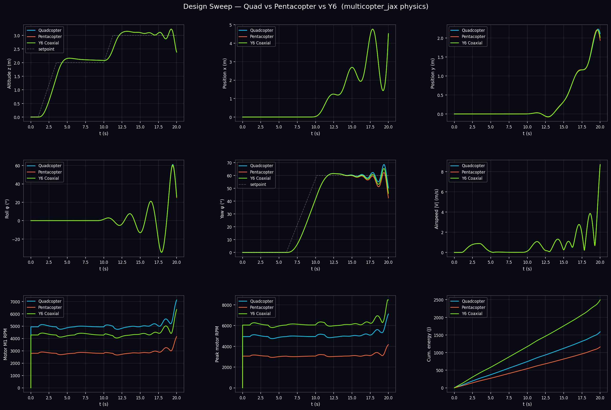 | 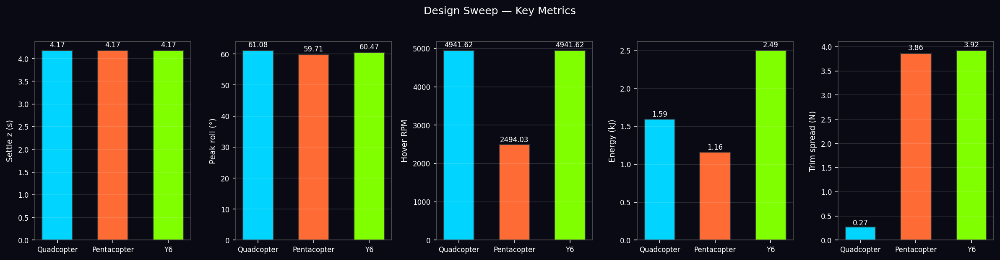 |

<details>
<summary>⚙️ Physics details — allocation matrix & trim</summary>

Each config uses the **minimum-norm allocation** `T_hover = A_pinv @ [m·g, 0, 0, 0]`:

- 🟦 **Quad** — symmetric: all 4 motors at 2.45 N, spread = 0 N
- 🟧 **Penta** — asymmetric: motors 1–5 range 1.14→3.54 N (off-centre 5th motor)
- 🟩 **Y6** — coaxial: 4 front motors at 1.84 N, 2 rear at 3.68 N (ratio = rotor count)

Coaxial pairs cancel yaw torque: net Mz = 0 at equal thrust. ✅

</details>

---

## 🎮 Hover Comparison — PD vs LQR

Full hover simulation for all 3 configs × 2 controllers (8 plots). Style mirrors the multicopter_jax validation demos.

```bash
JAX_PLATFORMS=cpu conda run -n num_python python3 run_hover_comparison.py
```

| | 🟦 Quadcopter | 🟧 Pentacopter | 🟩 Y6 Coaxial |
|---|---|---|---|
| **PD settle** | 5.59 s | 5.59 s | 5.59 s |
| **LQR settle** ⚡ | **1.60 s** | **1.65 s** | **1.70 s** |
| **Speedup** | 3.5× | 3.4× | 3.3× |
| **LQR stable?** | ✅ (λ=−1.45) | ✅ (λ=−0.80) | ✅ (λ=−0.78) |

**LQR is 3.4× faster to settle than PD** across all configs — the Jacobian-linearised CARE solution achieves optimal full-state feedback at hover trim.

| Altitude overlay (PD vs LQR) | Settle time + RPM summary |
|:---:|:---:|
| 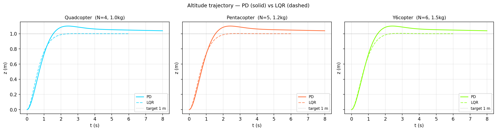 | 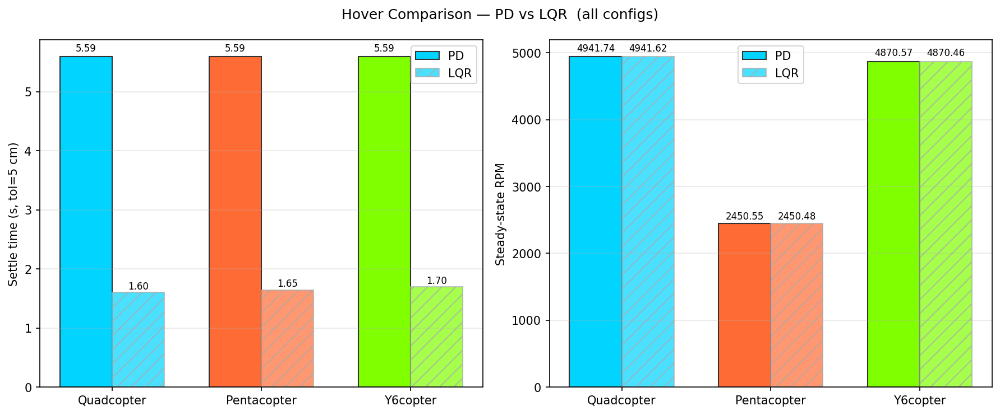 |

<details>
<summary>📐 Per-config 4-panel hover plots</summary>

| | PD controller | LQR controller |
|---|---|---|
| 🟦 **Quad** | 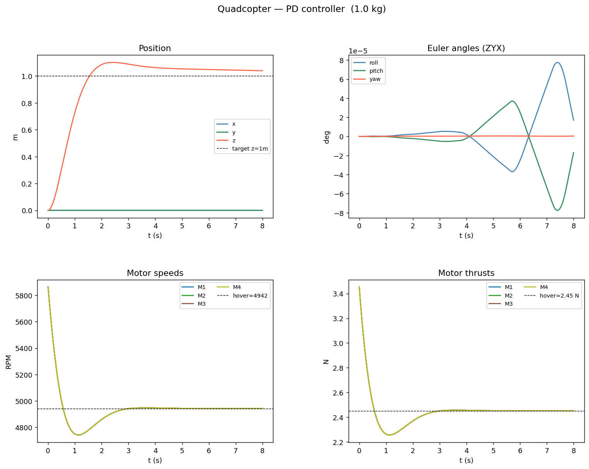 | 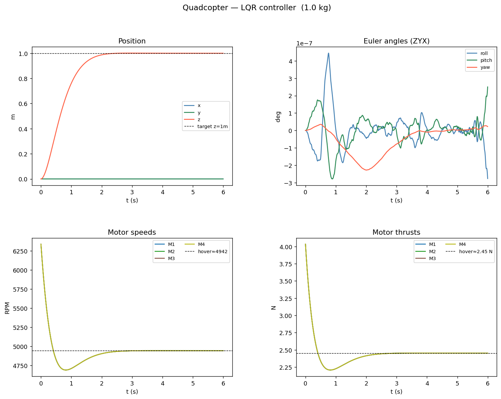 |
| 🟧 **Penta** | 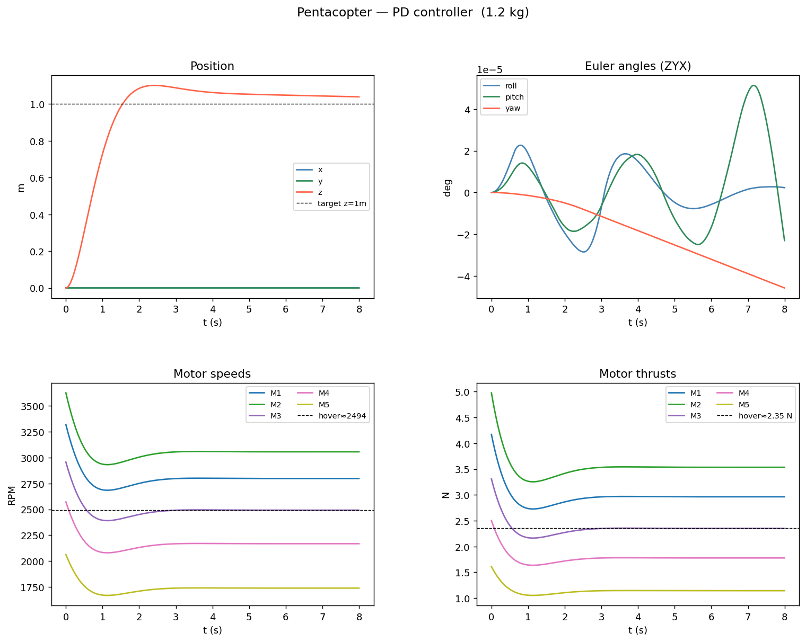 | 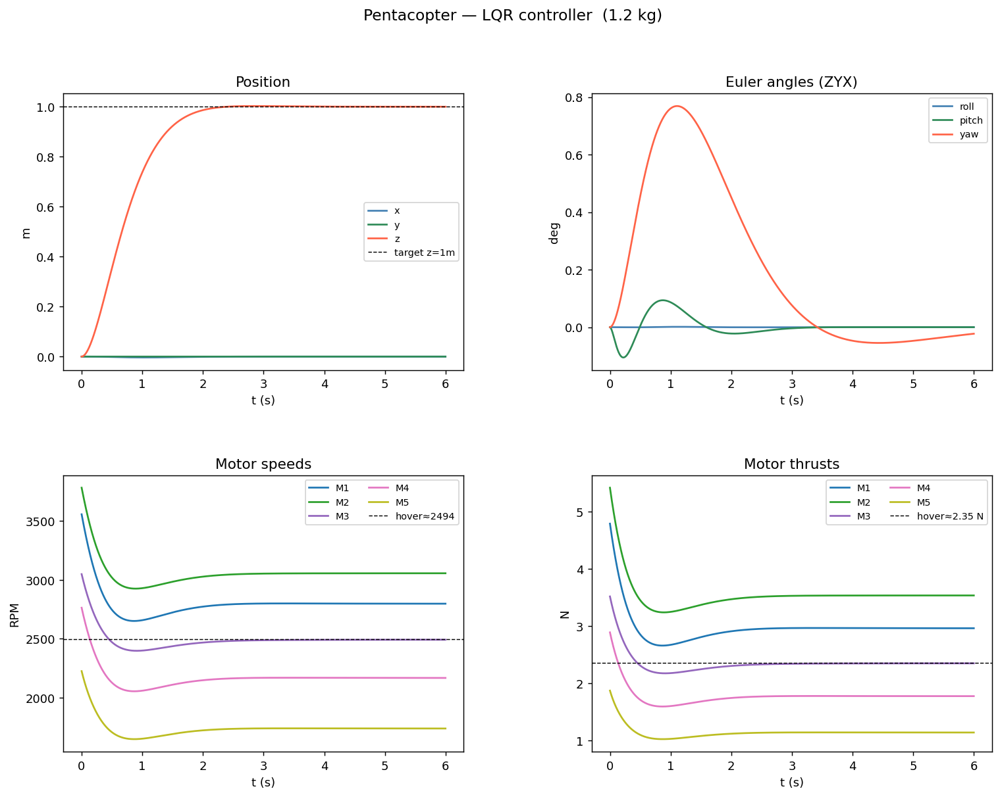 |
| 🟩 **Y6** | 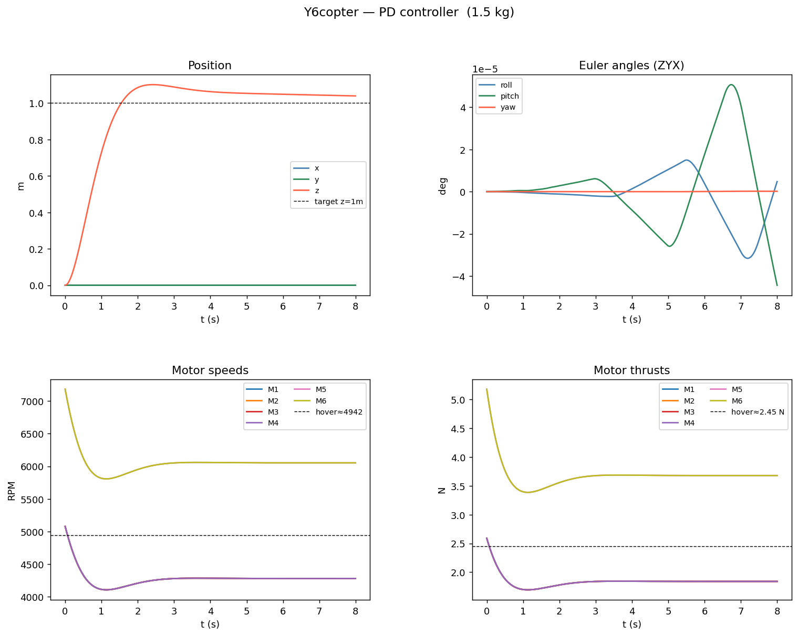 | 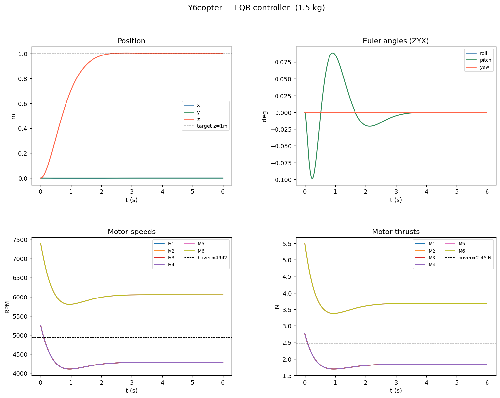 |

</details>

---

## 🏁 Multi-Drone Config Comparison (legacy BEM dynamics)

Three airframes, same 20 s mission, cascaded PID with inertia-scaled gains.

```bash
JAX_PLATFORMS=cpu conda run -n num_python python3 run_comparison.py
```

| Dynamics traces | RPM profiles | Summary |
|:---:|:---:|:---:|
| 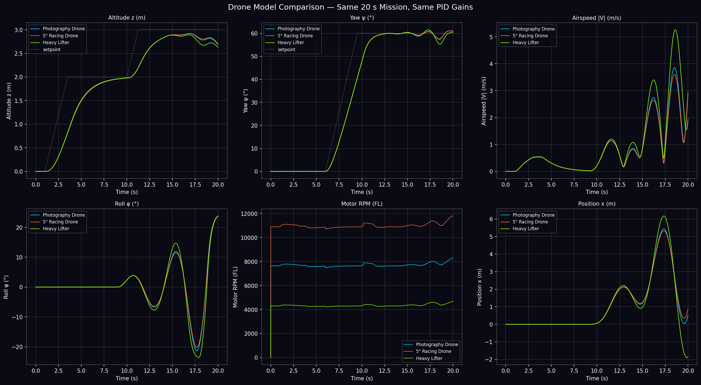 | 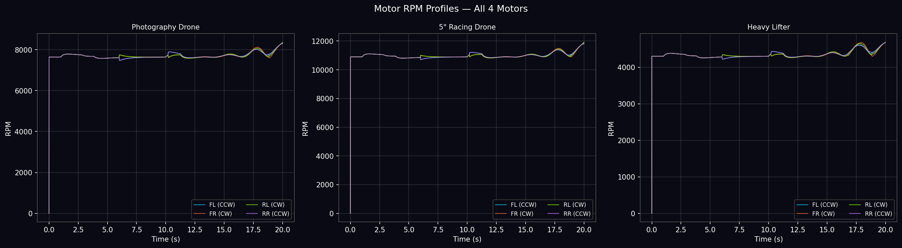 | 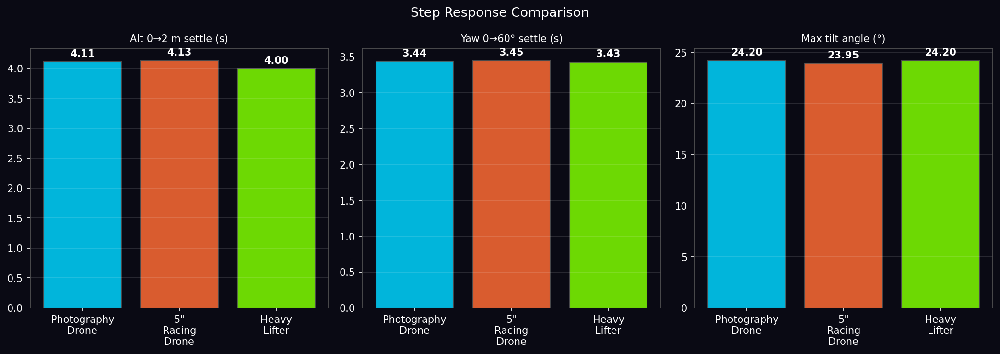 |

<details>
<summary>📊 Full comparison table</summary>

| Metric | 📷 Photography | 🏎️ 5" Racer | 🏋️ Heavy Lifter |
|---|---|---|---|
| **Mass** | 1.50 kg | 0.45 kg | 3.50 kg |
| **Prop size** | 8.0" (203 mm) | 5.0" (127 mm) | 13.0" (330 mm) |
| **CT / CQ** | 0.109 / 0.0095 | 0.105 / 0.0088 | 0.115 / 0.011 |
| **Arm span** | 254 mm | 120 mm | 380 mm |
| **Hover RPM** | 7 642 | 10 897 | 4 301 |
| **Max RPM (mission)** | 8 367 | 11 917 | 4 684 |
| **Alt 0→2 m settle** | 4.11 s | 4.13 s | 4.00 s |
| **Yaw 0→60° settle** | 3.44 s | 3.45 s | 3.43 s |
| **Max tilt** | 24.2° | 23.9° | 24.2° |

</details>

---

## 💨 CFD — Fuselage Flow

| 🌀 Vorticity field | 📊 Surface pressure Cp |
|:---:|:---:|
| 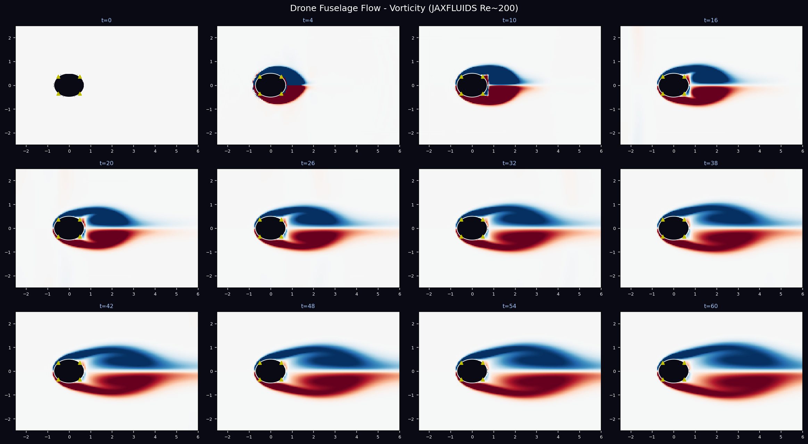 |  |

**🌊 Final frame — von Kármán vortex shedding, Re=200:**


<details>
<summary>📐 Geometry & grid setup</summary>

**Level-set ellipse** (matches 240×170 mm fuselage cross-section):
```python
"levelset": "lambda x,y: jnp.sqrt((x/0.706)**2 + (y/0.5)**2) - 1.0"
```

**Grid:** 300×180 cells, CONSTANT region 200×100 cells — **Δx=Δy=0.04 required** (square cells for level-set model).

**Physics:** Compressible Navier-Stokes, Re=200, Ma≈0.3, `end_time=60`.

**Arm root Cp output:**
```json
{ "arm_Cp": {"FL": -0.077, "FR": -0.175, "RL": -0.077, "RR": -0.175} }
```
</details>

---

## 🏗️ FEM — Structural Analysis

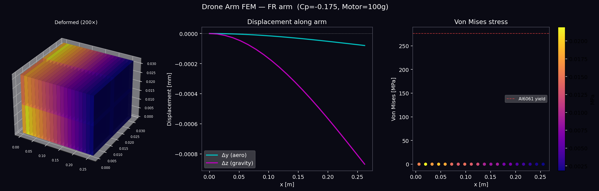

| 📏 Metric | 🔢 Value |
|---|---|
| Tip deflection Δz | −0.0009 mm |
| Max von Mises stress | 0.022 MPa |
| Safety factor (Al 6061, σ_y=276 MPa) | **12 574×** ✅ |

<details>
<summary>🔩 Mesh, material & load details</summary>

**Mesh:** 20×2×2 HEX8 elements → 189 nodes, 567 DOFs.  
**Material:** Al 6061 — E=70 GPa, ν=0.3, σ_yield=276 MPa.

**Physical load scaling:**
```
U_inf  = 10 m/s   →   q_phys = 0.5 × 1.225 × 10² = 61.25 Pa
F_aero = |Cp_FR| × q_phys × D × L = 0.175 × 61.25 × 0.032 × 0.262 = 0.090 N
F_grav = 0.08 × 9.81 = 0.785 N   (motor + ESC weight)
```

**Key finding:** At U=10 m/s gravity dominates; arm is extremely stiff (safety factor >12 000×). 🪶 Aero loads become significant above ~40 m/s.
</details>

---

## ✈️ 6-DOF Flight Dynamics

Powered by **multicopter_jax** — measurement-fitted kT/kQ, quaternion 13-state RK4, N-rotor allocation matrix.


| 🎯 Manoeuvre | ⏱️ Settle (5 cm tol) |
|---|---|
| Altitude 0 → 2 m | 4.17 s |
| Forward 4 m | — |
| Lateral 2 m | — |
| Yaw 0 → 60° | — |
| 🔄 Hover RPM | 4 942 RPM |

<details>
<summary>⚙️ State vector, motor model & controller</summary>

**State (13):** `[pos(3), q(4), vel(3), ω(3)]` — quaternion avoids gimbal lock.

**Motor model** (fitted from RCbenchmark measurement data):
```
kT = (ω² · F) / ‖ω²‖²    →  9.158×10⁻⁶ N/(rad/s)²
kQ = (ω² · τ) / ‖ω²‖²    →  1.343×10⁻⁷ N·m/(rad/s)²
```

**Allocation matrix A (4×N):**
```
[Fz, Mx, My, Mz]ᵀ = A @ [T₁,...,Tₙ]ᵀ
```
Row 0: all 1 (thrust) | Row 1: +y_i (roll) | Row 2: −x_i (pitch) | Row 3: reaction sign × kQ/kT (yaw)

**Hover trim (min-norm):** `T_hover_vec = A_pinv @ [m·g, 0, 0, 0]`

**Controllers:**
- 🔵 **PD**: cascaded position → attitude → allocation, settle ~5.6 s
- 🟠 **LQR**: jax.jacobian linearisation → scipy CARE → 12-state feedback, settle ~1.6 s
</details>

---

## 🌐 3D Browser Viewer

Interactive Three.js visualization combining drone model, live CFD slice, and FEM stress coloring.

```bash
# Pre-compute all viewer data
JAX_PLATFORMS=cpu conda run -n num_python python3 export_all.py

# Serve the viewer
cd viewer && conda run -n num_python python3 -m http.server 8787
# open http://localhost:8787
```


| 🎨 Element | 📖 What it shows |
|---|---|
| **CFD slice plane** 🌈 | Vorticity (red/blue) + pressure (magenta) — follows drone through flight |
| **Arm colours** 🟢→🟠→🔴 | Von Mises stress mapped 0→0.07 MPa — orange = near mission peak |
| **Stress rings** 💍 | Glowing rings at arm roots — highest bending moment location |
| **Rotor discs** 💠 | Opacity scales with RPM — brightest at full throttle |
| **Wake particles** 🔵 | Downwash from each motor tip, drift downward with spread |
| **Trajectory ribbon** 〰️ | Full 20 s 3D flight path |

**🎮 Controls:** Play/Pause + timeline scrubber · CFD Plane / Wake / Stress toggles · Orbit/pan/zoom with mouse.

---

## 🔬 JAXFLUIDS Validation Gallery

<table>
<tr>
  <td align="center"><b>✈️ NACA 0012 — Ma≈2, Re=∞</b><br></td>
  <td align="center"><b>💎 Diamond Airfoil — Ma≈2, viscous</b><br>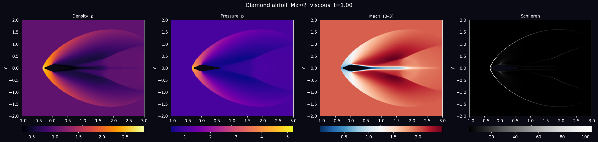</td>
</tr>
<tr>
  <td align="center"><b>🌊 Bow Shock — Ma≈2, viscous</b><br>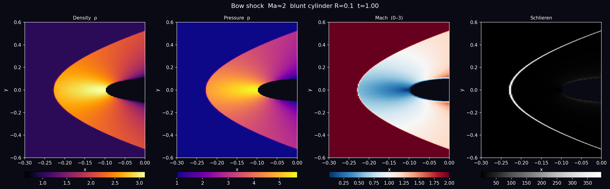</td>
  <td align="center"><b>💥 Double Mach Reflection — Ma=10</b><br>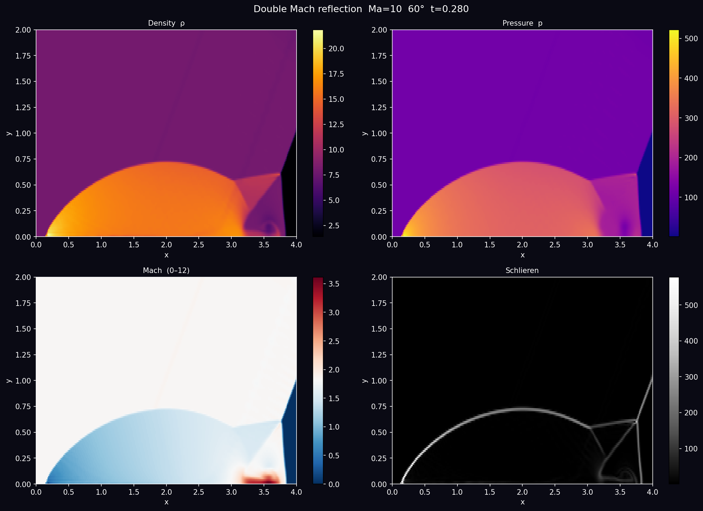</td>
</tr>
<tr>
  <td align="center"><b>🌊 Rayleigh-Taylor Instability</b><br>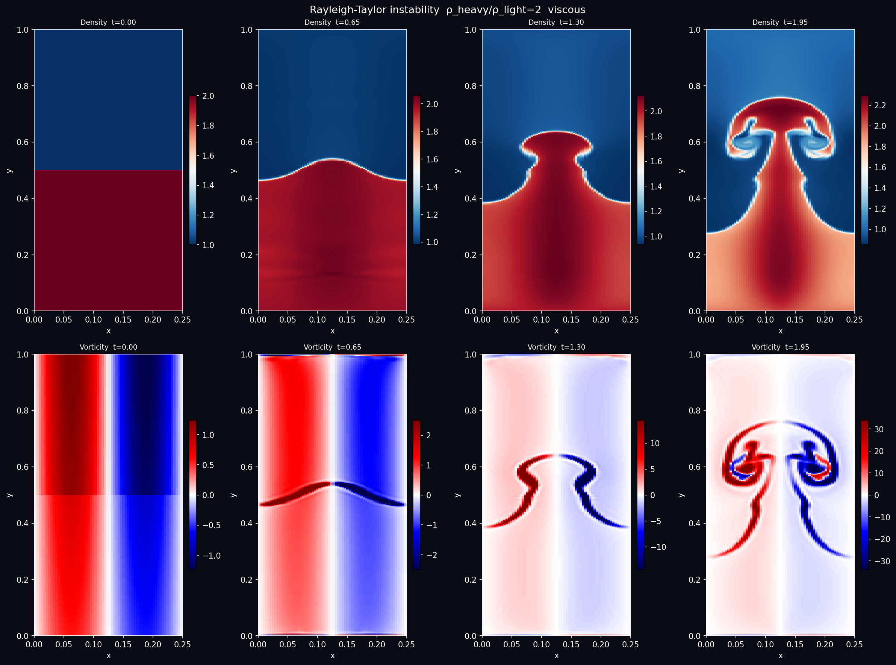</td>
  <td align="center"><b>🌬️ Blasius Boundary Layer — Ma≈2.25</b><br>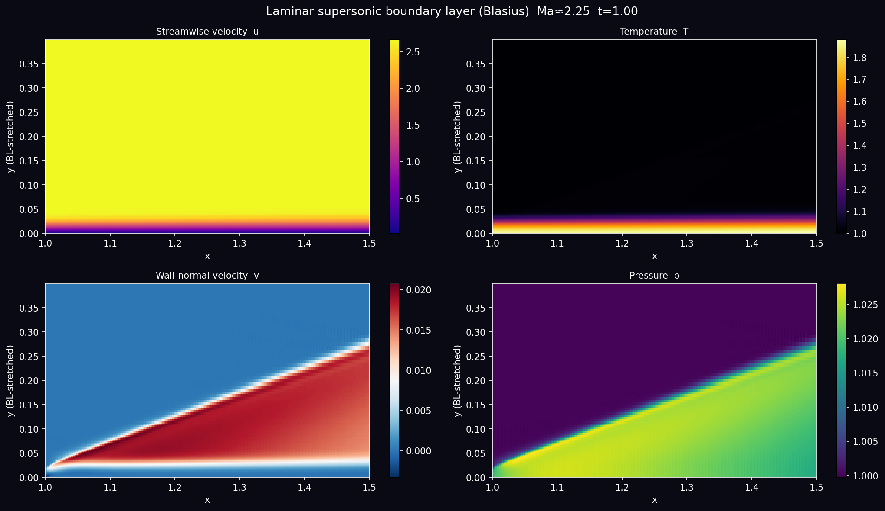</td>
</tr>
</table>

<details>
<summary>📋 Example parameters table</summary>

| Example | ⚡ Physics | 🔲 Grid | ⏱️ Wall time |
|---|---|---|---|
| `cylinder_flow` (drone) | Von Kármán shedding Re=200 | 300×180 | ~60 s sim |
| `NACA 0012` | Supersonic inviscid Ma≈2 | 256×128 | < 1 min |
| `diamond_airfoil` | Supersonic viscous Ma≈2 | 400×400 | 393 s |
| `bowshock` | Detached shock Ma≈2, viscous | 120×480 | 652 s |
| `double_mach_reflection` | Ma=10 shock at 60°, inviscid | 256×256 | 95 s |
| `rayleigh_taylor` | Heavy-over-light gravity instability | 64×256 | 48 s |
| `laminar_boundarylayer` | Blasius BL Ma≈2.25 | 200×100 | 534 s |

All run with `JAX_PLATFORMS=cpu conda run -n num_python python3 examples/run_<name>.py`
</details>

---

## 📂 Repository Structure

```
drone_flow/
│
├── 🗒️  pipeline.py               Master script — runs all 4 steps
├── 🗒️  export_all.py             Pre-compute viewer data
├── 🗒️  run_design_sweep.py       🆕 Quad / Penta / Y6 design sweep (20 s mission)
├── 🗒️  run_hover_comparison.py   🆕 PD vs LQR hover for all 3 configs
├── 📒  run_dynamics.py           Standalone dynamics test
│
├── 💨  cfd/                      JAXFLUIDS CFD configs + runner
├── 🏗️  fem/                      HEX8 FEM arm stress solver
│
├── ✈️  dynamics/
│   ├── jax_copter.py             🆕 multicopter_jax integration (kT/kQ fit, LQR/PD, JSON export)
│   ├── propeller.py              BEM legacy model
│   ├── dynamics.py               Newton-Euler 6-DOF + RK4 legacy
│   └── controller.py             Cascaded PD legacy
│
├── 🔬  examples/                 JAXFLUIDS validation cases
├── 📓  notebooks/                Jupytext percent-format (papermill-ready)
│
├── 🌐  viewer/
│   ├── index.html                🆕 Three.js: drone model + CFD plane + stress + particles
│   ├── trajectory.json           6-DOF states @ 30 fps (589 frames)
│   ├── fem_data.json             Arm stress samples (59 points)
│   ├── manifest.json             Frame metadata
│   └── cfd_frames/               PNG sequence (gitignored)
│
├── 🖼️  assets/
│   ├── design_sweep_comparison.png   🆕 9-panel time-series comparison
│   ├── design_sweep_stats.png        🆕 5-metric bar chart
│   ├── hover_comparison/             🆕 8 × 4-panel hover plots + summary
│   ├── viewer_final.png              🆕 3D viewer screenshot
│   └── ... (CFD + FEM + dynamics figures)
│
├── 📁  data/                     Small JSON outputs (committed)
└── 📁  results/                  JAXFLUIDS HDF5 output (gitignored, ~93 MB)
```

---

## ⚙️ Installation

```bash
conda activate num_python    # Python 3.13

pip install "jax[cpu]==0.9.2" jaxfluids==2.0.0
pip install "scipy>=1.11" h5py matplotlib
pip install "jupytext>=1.16" "papermill>=2.6"
```

Three.js `0.165.0` is pinned via CDN importmap in `viewer/index.html` — no npm required. 🎉

---

## 🐛 Key Bugs Fixed

<details>
<summary>Show all fixes</summary>

| 🐛 Bug | 🔍 Root cause | ✅ Fix |
|---|---|---|
| **JAXFLUIDS cell aspect ratio** | Level-set model requires Δx=Δy in fine region | Computed CONSTANT region so 200 cells / 8 units = 100 cells / 4 units = 0.04 |
| **Yaw mixer sign** | CCW motors create CW reaction — wrong sign for Mz | Speed up CW motors (FR/RL) for CCW airframe rotation |
| **JAXFLUIDS stencil names** | v2 uses hyphen `CENTRAL6-ADAP` not underscore | Patch config at runtime: `raw.replace("_ADAP", "-ADAP")` |
| **HDF5 vorticity shape** | z-vorticity stored as `(1, Ny, Nx, 1)` — last index | Index as `h["miscellaneous/vorticity"][0, :, :, 0]` |
| **Y6 LQR divergence** | Equal trim per motor creates pitch moment on asymmetric Y6 | `T_hover_vec = A_pinv @ [m·g, 0, 0, 0]` gives correct non-equal trim |
| **Package import collision** | `from dynamics import` resolved to `drone_flow/dynamics/` not `multicopter_jax/dynamics.py` | Add parent dir to `sys.path`; use `from multicopter_jax.dynamics import` |
| **LQR state reduction** | 13-state quaternion has redundant DOF; naïve T_map.T wrong | Proper right-inverse `R_map[4:7, 3:6] = 0.5·I` (δq_vec = δφ/2 at hover) |

</details>
