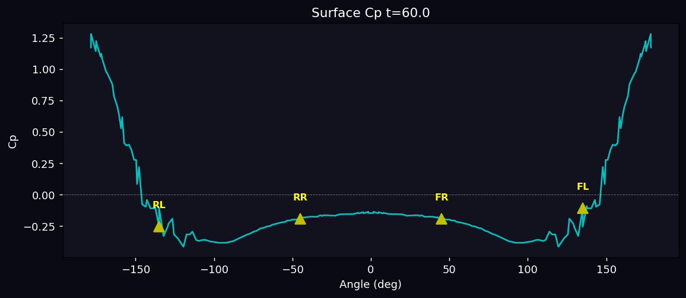
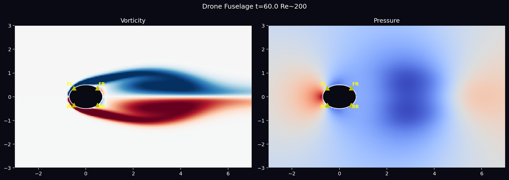
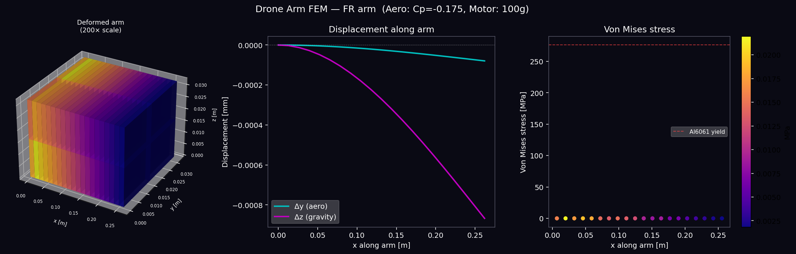
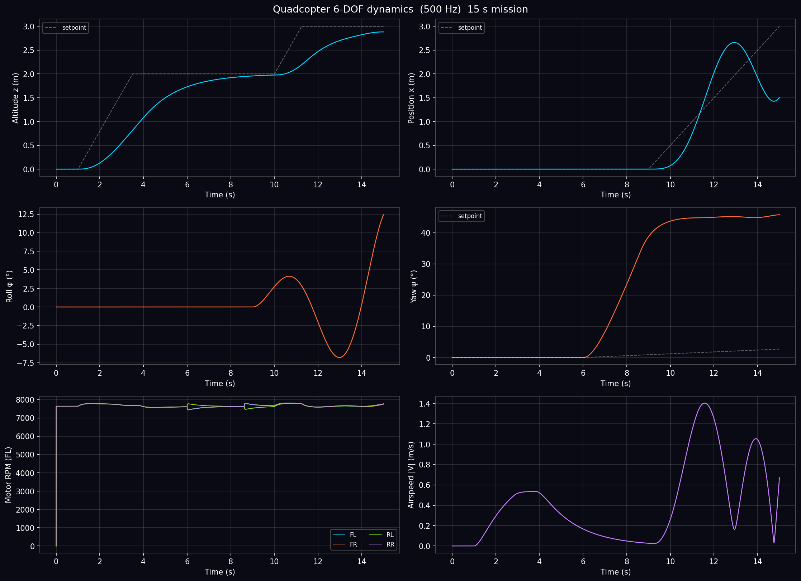
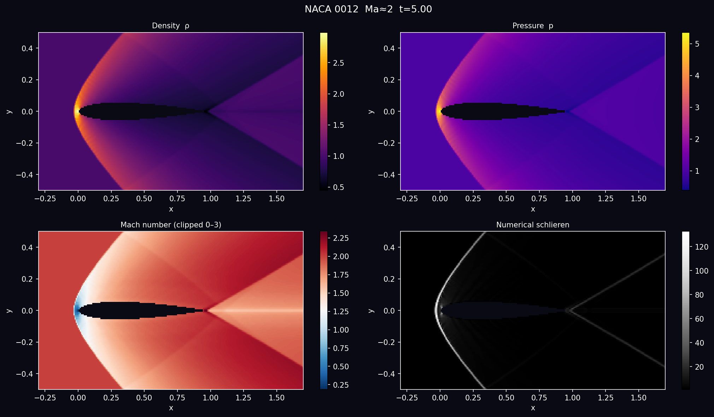

# 🚁 drone_flow — Multi-Physics Drone Simulation Pipeline

> **Fluid dynamics → Structural analysis → Flight dynamics → 3D browser visualization**
> A complete end-to-end simulation of a quadcopter drone — from CAD geometry through compressible CFD, HEX8 FEM, 6-DOF rigid-body dynamics, to an interactive Three.js browser animation.

Built on [JAXFLUIDS](https://github.com/tumaer/JAXFLUIDS) · [JAX](https://github.com/google/jax) · [scipy](https://scipy.org/) · [Three.js](https://threejs.org/)

---

## 🗺️ Pipeline Overview

```
🔧 Step 1 — Drone Geometry
   build123d CAD model  (240×170 mm fuselage, 4×262 mm arms)
   └─→ STEP → GLB  (Three.js animated model)

💨 Step 2 — Fuselage CFD                 [JAXFLUIDS, compressible NS]
   2D top-view cross-section, ellipse level-set
   Re=200, Ma≈0.3, end_time=60
   └─→ surface pressure Cp at 4 arm roots (FL/FR/RL/RR)
       drone_arm_loads.json

🏗️ Step 3 — Structural FEM              [scipy sparse, HEX8 elements]
   Drone arm  (Al 6061, 262 mm × 32 mm)
   Loads: Cp × q_phys + motor weight
   └─→ tip deflection, von Mises stress, safety factor
       drone_arm_fem_result.json

✈️  Step 4 — Flight Dynamics             [JAX, 500 Hz]
   6-DOF Newton-Euler + BEM propeller model
   Cascaded PID controller
   20 s mission: hover → climb → yaw → translate
   └─→ trajectory.json  (625 frames @ 30 fps)

🌐 Step 5 — Browser Viewer              [Three.js]
   Pre-computed frames animated in browser
   └─→ drone GLB attitude + CFD frames + FEM stress panel
       viewer/index.html
```

---

## 🎬 Simulation Results

### 💨 CFD — Drone Fuselage (Re=200, Ma≈0.3)

| Vorticity field | Surface pressure Cp |
|:---:|:---:|
|  |  |

**Final flow frame — vortex shedding around elliptical fuselage:**



---

### 🏗️ FEM — Arm Structural Analysis



| Parameter | Value |
|---|---|
| Tip deflection Δz | −0.0009 mm |
| Max von Mises stress | 0.022 MPa |
| Safety factor | 12,574× |

---

### ✈️ Flight Dynamics — 6-DOF Response



| Manoeuvre | Settle time (5%) |
|---|---|
| Altitude 0 → 2 m | 4.11 s |
| Altitude 2 → 3 m | 3.03 s |
| Yaw 0 → 60° | 2.17 s |

---

### 🔬 JAXFLUIDS Example Gallery

<table>
<tr>
  <td align="center"><b>NACA 0012 — Ma≈2</b><br></td>
  <td align="center"><b>Diamond Airfoil — Ma≈2</b><br></td>
</tr>
<tr>
  <td align="center"><b>Bow Shock — Ma≈2</b><br></td>
  <td align="center"><b>Double Mach Reflection — Ma=10</b><br></td>
</tr>
<tr>
  <td align="center"><b>Rayleigh-Taylor Instability</b><br></td>
  <td align="center"><b>Blasius Boundary Layer — Ma≈2.25</b><br></td>
</tr>
</table>

---

## 📂 Repository Structure

```
drone_flow/
│
├── 📄 README.md
├── 🔧 .gitignore
│
├── 💨 CFD (JAXFLUIDS)
│   ├── drone_flow.json          JAXFLUIDS case config  (ellipse level-set)
│   ├── numerical_setup.json     JAXFLUIDS numerical schemes
│   ├── run.py                   CFD simulation + arm load extraction
│   └── drone_arm_loads.json     Cp at 4 arm roots  (output)
│
├── 🏗️ FEM Structural
│   ├── drone_arm_fem.py         HEX8 FEM structural analysis
│   └── drone_arm_fem_result.json  Nodal displacements + von Mises  (output)
│
├── ✈️ drone_dynamics/
│   ├── propeller.py             BEM: T=CT·ρ·n²·D⁴, Q=CQ·ρ·n²·D⁵
│   ├── dynamics.py              Newton-Euler 6-DOF + RK4
│   └── controller.py            Cascaded PD: altitude + attitude + mixer
│
├── 🚀 Runners
│   ├── run_dynamics.py          20 s mission test + plots
│   ├── export_all.py            Pre-compute all viewer data
│   ├── run_naca.py              NACA 0012 example
│   ├── run_diamond.py           Diamond airfoil example
│   ├── run_bowshock.py          Bow shock example
│   ├── run_double_mach.py       Double Mach reflection
│   ├── run_blasius.py           Laminar boundary layer
│   └── run_rti.py               Rayleigh-Taylor instability
│
├── 🌐 viewer/
│   ├── index.html               Three.js animation viewer
│   ├── trajectory.json          6-DOF states @ 30 fps  (625 frames)
│   ├── fem_data.json            Arm stress samples  (63 points)
│   ├── manifest.json            Frame metadata
│   └── cfd_frames/              PNG sequence from JAXFLUIDS h5 files ¹
│
└── 🖼️ Result Images
    ├── drone_final_frame.png    CFD vortex shedding
    ├── drone_vorticity_full.png Vorticity field
    ├── drone_surface_Cp.png     Surface pressure distribution
    ├── drone_arm_fem.png        FEM stress visualization
    ├── dynamics_result.png      6-DOF state response
    ├── naca_result.png          NACA 0012 supersonic
    ├── diamond_result.png       Diamond airfoil
    ├── bowshock_result.png      Detached bow shock
    ├── double_mach_result.png   Double Mach reflection
    ├── rti_result.png           Rayleigh-Taylor instability
    └── blasius_result.png       Blasius boundary layer

¹ cfd_frames/ excluded from git — regenerated by export_all.py
```

---

## 🔬 Steps in Detail

### 🔧 Step 1 — Drone CAD Model

The drone geometry comes from [`gordensun/cad-power-animations`](https://github.com/gordensun/cad-power-animations), built with [build123d](https://github.com/gumyr/build123d):

- **Fuselage:** 240×170 mm elliptical body
- **Arms:** 4 arms at 45° (X-config), each 262 mm long, 32 mm diameter
- **Motors:** mounted at 360 mm from centre
- **Export:** STEP → GLB for Three.js

---

### 💨 Step 2 — Fuselage CFD (JAXFLUIDS)

We adapt the JAXFLUIDS `cylinder_flow` example to the drone's elliptical cross-section.

**Level-set geometry:**
```python
# Ellipse: a=0.706 (x), b=0.5 (y) — matches 240×170 mm aspect ratio
"levelset": "lambda x,y: jnp.sqrt((x/0.706)**2 + (y/0.5)**2) - 1.0"
```

**Grid:** 300×180 cells, CONSTANT region 200×100 cells (Δx=Δy=0.04, square cells required by level-set model)

**Physics:** Compressible Navier-Stokes, Re=200, Ma≈0.3, end_time=60

**Arm root locations** (45° on ellipse):
```python
arm_roots = {
    "FL": ( 0.499,  0.354),   # (a·cos45°, b·sin45°)
    "FR": ( 0.499, -0.354),
    "RL": (-0.499,  0.354),
    "RR": (-0.499, -0.354),
}
```

**Output:**
```json
{
  "arm_Cp":      {"FL": -0.077, "FR": -0.175, "RL": -0.077, "RR": -0.175},
  "arm_pressure":{"FL":  0.9952,"FR":  0.9890,"RL":  0.9952,"RR":  0.9890}
}
```

```bash
JAX_PLATFORMS=cpu conda run -n num_python python3 run.py
```

---

### 🏗️ Step 3 — Structural FEM

HEX8 finite-element analysis of the FR arm under combined aerodynamic and gravity loads.

**Mesh:** 20×2×2 HEX8 elements (189 nodes, 567 DOFs)  
**Material:** Al 6061 — E=70 GPa, ν=0.3, σ_yield=276 MPa

**Physical scaling:**
```python
U_inf  = 10 m/s   →   q_phys = 0.5 × 1.225 × 10² = 61.25 Pa
F_aero = Cp_FR × q_phys × D × L = 0.175 × 61.25 × 0.032 × 0.262 = 0.090 N
F_grav = 0.08 × 9.81 = 0.981 N   (motor weight)
```

**Results at U=10 m/s:**

| Metric | Value |
|---|---|
| Tip deflection Δz | −0.0009 mm |
| Max von Mises | 0.022 MPa |
| Safety factor | **12,574×** ✅ |

```bash
JAX_PLATFORMS=cpu conda run -n num_python python3 drone_arm_fem.py
```

---

### ✈️ Step 4 — 6-DOF Flight Dynamics

Newton-Euler rigid-body equations integrated at 500 Hz using RK4 in JAX.

**State vector (12):** `[px, py, pz, φ, θ, ψ, u, v, w, p, q, r]`

**Propeller BEM model:**
```python
T = CT · ρ · n² · D⁴    # thrust   (CT=0.109, D=0.203 m)
Q = CQ · ρ · n² · D⁵    # torque   (CQ=0.0095)
# Hover: 4 × 7642 RPM → T_total = 14.71 N = 1.5 kg × g
```

**Motor layout (X-config):**
```
  FL (CCW) ──── FR (CW)
      \            /
       \          /
        \        /
  RL (CW) ──── RR (CCW)
```

**Mixer — positive yaw (CCW) requires CW motors to speed up:**
```python
T_FL = T/4 - Mx/(4L) + My/(4L) - Mz/(4r)   # CCW motor
T_FR = T/4 + Mx/(4L) + My/(4L) + Mz/(4r)   # CW motor
T_RL = T/4 - Mx/(4L) - My/(4L) + Mz/(4r)   # CW motor
T_RR = T/4 + Mx/(4L) - My/(4L) - Mz/(4r)   # CCW motor
```

```bash
JAX_PLATFORMS=cpu conda run -n num_python python3 run_dynamics.py
```

---

### 🌐 Step 5 — Three.js Visualization

Pre-compute all data then animate in the browser — **no live server needed.**

```bash
# 1. Export all viewer data
JAX_PLATFORMS=cpu conda run -n num_python python3 export_all.py

# 2. Serve from parent directory and open
cd /path/to/gi
python3 -m http.server 7800
# open http://localhost:7800/drone_flow/viewer/
```

**Generated files:**
```
viewer/
├── trajectory.json     625 frames @ 30 fps  (position, attitude, RPM)
├── fem_data.json       63 stress samples along trajectory
├── manifest.json       frame counts, CFD time mapping
└── cfd_frames/
    └── frame_000..030.png   vorticity + pressure panels
```

**Viewer features:**
- 🚁 Drone GLB with live attitude from 6-DOF trajectory
- 💨 CFD vorticity/pressure panel (31 snapshots, t=0→60)
- 🏗️ FEM arm stress: von Mises, tip deflection, safety factor
- 🔄 All 4 motor RPMs
- ⏱️ Timeline scrubber + play/pause

---

## 🔬 JAXFLUIDS Example Gallery

| Example | Physics | Grid | Sim time |
|---|---|---|---|
| `cylinder_flow` | Von Kármán vortex shedding Re=200 | 300×180 | ~60 s |
| `NACA 0012` | Supersonic airfoil Ma≈2, inviscid | 256×128 | fast |
| `diamond_airfoil` | Supersonic wedge Ma≈2, viscous | 400×400 | 393 s |
| `bowshock` | Detached bow shock Ma≈2, viscous | 120×480 | 652 s |
| `double_mach_reflection` | Ma=10 shock at 60°, inviscid | 256×256 | 95 s |
| `rayleigh_taylor` | Heavy-over-light gravity instability | 64×256 | 48 s |
| `laminar_boundarylayer` | Supersonic Blasius BL Ma≈2.25 | 200×100 | 534 s |

---

## ⚙️ Dependencies

```bash
conda activate num_python   # Python 3.13, JAX 0.9.2, scipy, h5py, matplotlib
pip install jaxfluids       # from tumaer/JAXFLUIDS
```

Three.js loaded from CDN — no npm needed.

---

## 🐛 Key Bugs Fixed

| Bug | Fix |
|---|---|
| **JAXFLUIDS cell aspect ratio** | Grid fine region must have Δx=Δy (square cells) for level-set model. Fixed by matching CONSTANT region cell counts to span. |
| **Yaw mixer sign** | Positive Mz (CCW airframe rotation) requires speeding up CW motors (FR/RL), not CCW motors (FL/RR). Newton's 3rd law — CCW props pull airframe CW. |
| **JAXFLUIDS stencil names** | Older configs use `CENTRAL6_ADAP` (underscore); installed version requires `CENTRAL6-ADAP` (hyphen). Patched at runtime. |
| **HDF5 vorticity shape** | 2D vorticity field is stored as `(1, Ny, Nx, 1)` — index as `[0, :, :, 0]` not `[0, 2]`. |
| **Altitude runaway** | Hard step setpoints caused massive overshoot. Fixed: clamp error to ±1 m and use smooth velocity ramps. |
